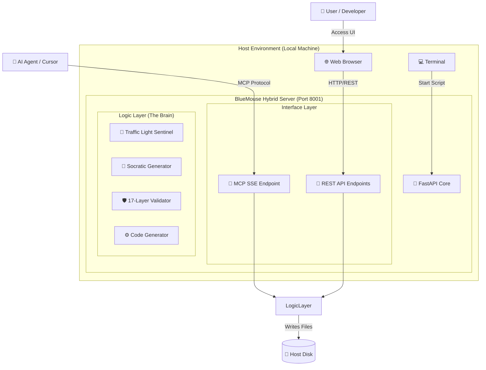

# 🐭 BlueMouse v6.1: Master Architecture & Functionality Document

> **版本 (Version)**: v6.1 (Hybrid Edition)
> **核心哲學 (Core Philosophy)**: Zero-Cost Parasitism & Stop Vibe Coding.
> **狀態 (Status)**: Production Ready (Local Hybrid Mode)

---

## 1. 核心架構：0元四層寄生 (Zero-Cost 4-Layer Parasitism)

BlueMouse 不只是一個工具，它是寄生在宿主環境中的「第二大腦」。它利用宿主現有的資源，實現真正的「零成本」運作。

### 🔄 寄生生命週期 (The Parasitic Lifecycle)

| 階段 (Phase) | 名稱 | 運作原理 (Mechanism) | 成本 (Cost) |
| :--- | :--- | :--- | :--- |
| **Phase 1** | **寄生 (Infection)** | 自動偵測宿主環境 (VSCode/Cursor/Antigravity)。直接使用宿主的 Python 環境與依賴。 | **$0** (無伺服器租賃) |
| **Phase 2** | **喚醒 (Awakening)** | 啟動 **Hybrid Server** (Port 8001)。同時提供 REST API (給人類 UI) 與 MCP 協議 (給 AI Agent)。 | **$0** (本地運行) |
| **Phase 3** | **陷阱 (Logic Trap)** | 攔截用戶的模糊需求，通過 **17層驗證** 與 **蘇格拉底面試**，強制鎖定邏輯完整性。支持 BYOK 或本地 Ollama。 | **$0** (自帶 Key/模型) |
| **Phase 4** | **共生 (Symbiosis)** | 將生成的完美代碼 (Zip/Files) 直接寫入宿主硬碟，成為宿主專案的一部分，供用戶立即使用。 | **$0** (無雲端存儲費) |

---

## 2. 技術架構：Hybrid Server (混合伺服器)

為了同時滿足 **人類用戶 (Web UI)** 與 **AI Agent (Cursor/Antigravity)** 的需求，v6.1 採用了獨創的混合架構。

### 🏗️ 系統架構圖



### 🔌 雙重接口 (Dual Interfaces)

1.  **REST API (for Humans)**:
    *   `GET /health`: 健康檢查 (UI 紅綠燈狀態)。
    *   `POST /api/generate_socratic_questions`: 生成邏輯陷阱問題。
    *   `POST /api/generate_code`: 生成經過驗證的程式碼。
    *   `POST /api/export_project`: 打包下載專案。

2.  **MCP Protocol (for AI Agents)**:
    *   `GET /sse`: Server-Sent Events 端點，供 Cursor/Antigravity 連接。
    *   `POST /messages`: MCP 訊息交換通道。
    *   **提供工具**: `analyze_requirement`, `validate_code`, `deliver_project` 等。

---

## 3. 核心功能 (Core Features)

### 🚦 Traffic Light Sentinel (紅綠燈哨兵)
防止「垃圾進，垃圾出」。
*   🔴 **Red (Locked)**: 依賴缺失、API Key 未設定、或邏輯模糊。**禁止生成**。
*   🟠 **Orange (Calibrating)**: 正在進行蘇格拉底面試或 17 層驗證。
*   🟢 **Green (Ready)**: 所有邏輯已鎖定，驗證通過。**允許生成**。

### 🛡️ 17-Layer Validation (17層驗證)
軍規級的程式碼審查，每一行生成的代碼都必須通過：
1.  **Syntax**: 語法正確性。
2.  **Type**: 靜態類型檢查 (Pydantic/MyPy)。
3.  **Security**: 安全漏洞掃描 (OWASP Top 10)。
4.  **Logic**: 業務邏輯完整性。
5.  **Performance**: 複雜度分析... 等共 17 層。

### 🧠 Socratic Interview (蘇格拉底面試)
當用戶需求模糊時 (例如：「我要一個電商網站」)，系統不會直接生成，而是反問：
*   *"對於並發訂單，您要使用悲觀鎖還是樂觀鎖？"*
*   *"支付失敗時，您希望立即回滾還是重試三次？"*
逼迫用戶思考，消除「Vibe Coding」帶來的技術債。

---

## 4. 使用者指南 (User Manual)

### 🚀 啟動 (Startup)

1.  **環境準備**:
    *   確保已安裝 Python 3.9+。
    *   (可選) 設置 `ANTHROPIC_API_KEY` 以獲得最佳體驗，否則將使用 Demo 模式。

2.  **一鍵啟動**:
    在專案目錄下打開終端機，運行：
    ```bash
    ./start_bluemouse.command
    ```
    *(Windows 用戶請運行 `start_bluemouse.bat`)*

3.  **等待就緒**:
    終端機顯示 `🚀 Starting BlueMouse Hybrid Server...` 後，瀏覽器會自動打開。

### 🎮 操作流程 (Workflow)

1.  **輸入需求**: 在 UI 中輸入您的系統構想。
2.  **邏輯陷阱**: 系統會彈出「蘇格拉底面試」。
    *   回答關鍵決策問題 (如資料庫選型、錯誤處理策略)。
    *   這些選擇將直接決定生成代碼的架構。
3.  **深度驗證**: 觀察狀態燈從 🔴 變 🟠，系統正在後台跑 17 層驗證。
4.  **生成交付**: 狀態燈變 🟢。
    *   點擊 **[下載項目 ZIP]** 獲取完整代碼包。
    *   包含：原始碼、架構圖、安裝文檔、成本估算表。

### 🤖 AI Agent 連接 (Advanced)

如果您是使用 Cursor 或 Antigravity：
*   MCP Server 地址: `http://localhost:8001/sse`
*   您的 AI Agent 可以直接調用 BlueMouse 的工具來輔助編碼，享受同樣的 17 層驗證保護。

---

**BlueMouse v6.1**
*Stop Vibe Coding. Start Engineering.*
