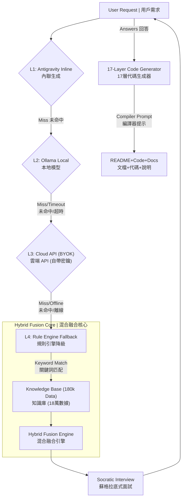

# 🐭 BlueMouse v6.6
### The AI Safety Layer for Cursor & Claude | AI 代碼安全層
**Stop Vibe Coding. Start Engineering. | 拒絕憑感覺寫代碼，回歸工程思維。**


[](https://glama.ai/mcp/servers/@peijun1700/bluemouse)
[](https://smithery.ai/server/peijun1700/Bluemouse)
[](docs/reports/STATUS_REPORT_v6.6.md)
[](LICENSE)

[](PRIVACY.md)
[](CURSOR_GUIDE.md)

> **Contact | 聯繫:** bluemouse.ai@gmail.com

---

## 🌟 Why BlueMouse? | 為什麼選擇 BlueMouse？

**[EN]** In the era of **Vibe Coding**, AI generates code faster than we can read. But even the best AI (Claude 3.5 / 4.5) hallucinates. **BlueMouse is your Airbag.** It's not another coding tool—it's a **Quality Gate** that stops bad code before it happens.

**[中文]** 在 **Vibe Coding** 盛行的時代，AI 產生代碼的速度比我們閱讀的速度還快。但即使是最強的 AI (Claude 3.5 / 4.5) 也會出現邏輯幻覺。**BlueMouse 是您的安全氣囊。** 它不是另一個寫代碼的工具，它是**阻止爛代碼發生的守門員**。

### The Problem | 問題所在
- ❌ **[EN]** AI generates code by "vibes" without deep logic validation
- ❌ **[中文]** AI 憑感覺生成代碼，沒有深度邏輯驗證
- ❌ **[EN]** Edge cases are completely ignored
- ❌ **[中文]** 邊界情況完全沒考慮
- ❌ **[EN]** Tech debt explodes silently
- ❌ **[中文]** 技術債默默爆炸
- ❌ **[EN]** You find bugs in production, not development
- ❌ **[中文]** 在正式環境才發現 Bug，不是在開發階段

### The Solution | 解決方案
- ✅ **17-Layer Validation | 17層驗證** - Every line passes through AST parsing, type checking, and security audits | 每一行代碼都經過 AST 解析、型別檢查和安全審計
- ✅ **Socratic Interview | 蘇格拉底式面試** - AI must answer logic questions before generating code | AI 必須先回答邏輯問題才能生成代碼
- ✅ **Zero Infrastructure Cost | 零基礎設施成本** - 100% local execution, no servers needed | 100% 本地執行，不需要伺服器
- ✅ **One-Word Start | 一鍵啟動** - Just type "Start" in Cursor | 只需在 Cursor 中輸入 "Start"

---

## 🔥 Core Features | 核心功能

### 🦠 Parasitic Architecture | 寄生架構
**[EN]** $0 Infrastructure Cost. BlueMouse sits between you and the compiler, intercepting commands in <10ms. No servers, no subscriptions, no cloud dependencies.

**[中文]** **$0 營運成本**。BlueMouse 寄生於您的開發環境，以 <10ms 的速度攔截指令。無需伺服器、訂閱或雲端依賴。

### 🧠 Socratic Logic Gate | 蘇格拉底邏輯門
**[EN]** Before writing code, BlueMouse interviews the AI with critical questions:
- *"For concurrent orders, pessimistic lock or optimistic lock?"*
- *"On payment failure, rollback immediately or retry 3 times?"*

**[中文]** 在寫代碼之前，BlueMouse 會用關鍵問題面試 AI：
- *「對於並發訂單，使用悲觀鎖還是樂觀鎖？」*
- *「支付失敗時，立即回滾還是重試 3 次？」*

Forces you (and AI) to think before coding. | 強制您（和 AI）在寫代碼前先思考。

### 🛡️ 17-Layer Validation | 17層驗證
**[EN]** Code generation passes through 17 logic gates:

**[中文]** 代碼生成必須通過 17 道邏輯閘：

1. **Syntax | 語法** - Correctness | 正確性
2. **Type | 型別** - Static type checking (Pydantic/MyPy) | 靜態型別檢查
3. **Security | 安全** - OWASP Top 10 scanning | OWASP Top 10 掃描
4. **Logic | 邏輯** - Business logic integrity | 業務邏輯完整性
5. **Performance | 性能** - Complexity analysis | 複雜度分析
... and 12 more layers | ...以及另外 12 層

### 👆 One-Word Start | 一鍵啟動
```bash
# Just drag the folder into Cursor and type:
# 只需將資料夾拖進 Cursor 並輸入：
Start
```
BlueMouse automatically injects `.cursorrules` and starts protecting your code.

BlueMouse 會自動注入 `.cursorrules` 並開始保護您的代碼。

---

## 📐 System Architecture | 系統架構

**[EN]** BlueMouse uses a 4-layer hybrid architecture with intelligent fallback:

**[中文]** BlueMouse 使用 4 層混合架構,具有智能降級機制:



**Key Features | 核心特性:**
- ✅ **Zero Single Point of Failure | 無單點故障** - 4-layer fallback ensures 100% uptime | 4層降級確保 100% 可用性
- ✅ **Offline-First | 離線優先** - Works without internet | 無需網路即可運行
- ✅ **BYOK (Bring Your Own Key) | 自帶密鑰** - Use your own API keys or local models | 使用您自己的 API 密鑰或本地模型
- ✅ **180k Knowledge Base | 18萬知識庫** - Pre-loaded with 28 high-risk scenarios | 預載 28 個高風險場景

---

## 🏆 Industrial Grade Certification | 工業級認證

BlueMouse v6.6 has passed rigorous stress tests | BlueMouse v6.6 已通過嚴格的壓力測試：

| Test Protocol | Status | Description |
| :--- | :--- | :--- |
| **Antarctica Protocol** | ✅ **PASSED** | 100% functionality in offline/air-gapped environments<br/>離線/隔離環境下 100% 功能正常 |
| **Bilingual Acid Test** | ✅ **PASSED** | Seamless dynamic language switching (zh-TW / en-US)<br/>無縫動態語言切換（繁中/英文） |
| **Data Resilience** | ✅ **PASSED** | Validated against 28 high-concurrency/financial-risk scenarios<br/>針對 28 個高並發/金融風險場景驗證 |
| **Security Hardening** | ✅ **PASSED** | XSS, SQL Injection, Path Traversal protection<br/>XSS、SQL 注入、路徑遍歷防護 |
| **Vetting Depth** | ✅ **17 LAYERS** | Code generation piped through 17 logic gates<br/>代碼生成通過 17 道邏輯閘 |

---

## 🚀 Quick Start | 快速開始

### System Requirements | 系統需求
- **Python**: 3.9+
- **OS**: macOS / Linux / Windows
- **Disk Space | 硬碟空間**: ~50MB
- **Network | 網路**: Optional (works 100% offline) | 可選（可 100% 離線運行）

### Installation | 安裝

#### Option 1: One-Click Start | 選項 1：一鍵啟動 (Recommended | 推薦)
**Mac/Linux:**
```bash
./Start
```

**Windows:**
```bash
Start
```

#### Option 2: Manual Start | 選項 2：手動啟動
**Mac/Linux:**
```bash
python3 -m pip install -r requirements.txt
python3 start_v6.py
```

**Windows:**
```bash
python -m pip install -r requirements.txt
python start_v6.py
```

The server will start on `http://localhost:8001` and your browser will open automatically.

伺服器將在 `http://localhost:8001` 啟動，瀏覽器會自動打開。

---

## 📖 Usage | 使用方法

### 1. Enter Your Vision | 輸入您的構想
**[EN]** Describe what you want to build:
```
I want to build an e-commerce platform with user authentication
```

**[中文]** 描述您想建立的系統：
```
我想做一個電商平台，有用戶認證功能
```

### 2. Answer Socratic Questions | 回答蘇格拉底式問題
**[EN]** BlueMouse will ask critical logic questions:
- Database concurrency strategy?
- Error handling approach?
- Security measures?

**[中文]** BlueMouse 會詢問關鍵邏輯問題：
- 資料庫並發策略？
- 錯誤處理方式？
- 安全措施？

### 3. Get Validated Code | 獲得驗證過的代碼
**[EN]** After passing 17 layers of validation, download your project ZIP containing:

**[中文]** 通過 17 層驗證後，下載包含以下內容的專案 ZIP：

- ✅ Source code | 原始碼
- ✅ Architecture diagrams | 架構圖
- ✅ Installation guide | 安裝指南
- ✅ Cost estimation | 成本估算
- ✅ Validation report | 驗證報告

---

## 🛡️ Enterprise Security | 企業安全

### 100% Local Execution | 100% 本地執行
- ✅ No data leaves your machine | 數據不離開您的電腦
- ✅ No cloud dependencies | 無雲端依賴
- ✅ No telemetry or tracking | 無遙測或追蹤
- ✅ Works in air-gapped environments | 可在隔離環境運行

### AGPLv3 License | AGPLv3 授權
- ✅ Open source for transparency | 開源透明
- ✅ Commercial use requires compliance | 商業使用需遵守協議
- ✅ Protects against closed-source forks | 防止閉源分支

**Read our [Privacy Whitepaper](PRIVACY.md)** for technical details.

**閱讀我們的[隱私白皮書](PRIVACY.md)**了解技術細節。

---

## 🔧 Troubleshooting | 故障排除

### `python3: command not found`
**Mac/Linux:**
```bash
brew install python3
```
**Windows:** Download from [python.org](https://www.python.org/downloads/)

### `pip install` fails | `pip install` 失敗
Try using a mirror | 嘗試使用鏡像：
```bash
pip install -r requirements.txt -i https://pypi.tuna.tsinghua.edu.cn/simple
```

### Port 8001 already in use | 端口 8001 已被占用
```bash
# Find and kill the process | 查找並終止進程
lsof -ti:8001 | xargs kill -9  # Mac/Linux
netstat -ano | findstr :8001   # Windows
```

### Permission denied | 權限被拒絕
```bash
chmod +x start_bluemouse.command  # Mac/Linux
```

### `ModuleNotFoundError` | 模組未找到
```bash
pip install -r requirements.txt --force-reinstall
```

### Browser doesn't open | 瀏覽器未打開
Manually navigate to | 手動訪問: `http://localhost:8001`

---

## 📚 Documentation | 文檔

- **[System Architecture | 系統架構](BlueMouse_v6.6_MASTER_ARCH.md)** - Technical deep dive | 技術深入解析
- **[Changelog | 更新日誌](CHANGELOG.md)** - Version history | 版本歷史
- **[Privacy Policy | 隱私政策](PRIVACY.md)** - Data handling details | 數據處理細節
- **[License | 授權](LICENSE)** - AGPLv3 terms | AGPLv3 條款
- **[Cursor Integration Guide | Cursor 整合指南](CURSOR_GUIDE.md)** - IDE setup | IDE 設定

---

## 🌍 Community | 社群

- **GitHub Issues**: [Report bugs or request features | 回報錯誤或請求功能](https://github.com/peijun1700/bluemouse/issues)
- **Discussions**: [Join the conversation | 加入討論](https://github.com/peijun1700/bluemouse/discussions)
- **Email | 電子郵件**: bluemouse.ai@gmail.com

---

## 🎯 Roadmap | 路線圖

### v6.6 (Current | 當前版本)
- ✅ 17-Layer validation system | 17層驗證系統
- ✅ Socratic question library (22 questions, 10 categories) | 蘇格拉底問題庫（22 個問題，10 個類別）
- ✅ Bilingual support (zh-TW / en-US) | 雙語支援（繁中/英文）
- ✅ Zero-cost parasitic architecture | 零成本寄生架構

### v7.0 (Planned | 計劃中)
- 🔄 Frontend template generation | 前端模板生成
- 🔄 Custom question library | 自定義問題庫
- 🔄 Team collaboration features | 團隊協作功能
- 🔄 Enterprise audit logs | 企業審計日誌

---

## 📄 License | 授權

BlueMouse is licensed under **AGPLv3** | BlueMouse 採用 **AGPLv3** 授權。

**What this means | 這意味著:**
- ✅ Free for personal use | 個人使用免費
- ✅ Free for open-source projects | 開源專案免費
- ⚠️ Commercial use requires compliance (or contact us for licensing) | 商業使用需遵守協議（或聯繫我們獲取授權）

See [LICENSE](LICENSE) for details | 詳見 [LICENSE](LICENSE)。

---

## 🙏 Acknowledgments | 致謝

Built with | 使用以下技術構建:
- **FastAPI** - Modern Python web framework | 現代 Python Web 框架
- **Pydantic** - Data validation | 數據驗證
- **Anthropic Claude** - AI reasoning (optional) | AI 推理（可選）
- **Ollama** - Local AI models (optional) | 本地 AI 模型（可選）

---

## 📊 Stats | 統計


---

**Made with ❤️ by developers who care about code quality**

**由關心代碼品質的開發者用心打造**

**Stop Vibe Coding. Start Engineering. | 拒絕憑感覺寫代碼，回歸工程思維。** 🐭
