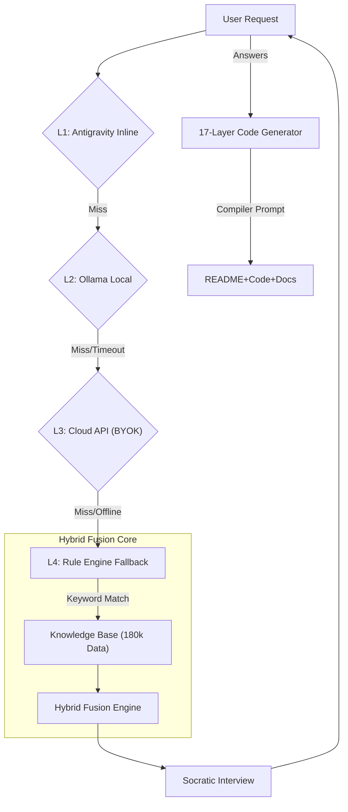

# 🐭 BlueMouse (藍圖小老鼠) v6.1
### The "Prefrontal Cortex" for Generative AI.
**讓您的 AI 寫程式前，先經過「大腦」思考。**


[](docs/reports/STATUS_REPORT_v6.1.md)
[](LICENSE)

[](LICENSE)
[](CURSOR_GUIDE.md)

---

## 🌟 Why BlueMouse? (為什麼你需要它？)

**[EN]** In the era of **Vibe Coding**, AI generates code faster than we can read. But even the best AI (Claude 3.5 / 4.5) hallucinates. **BlueMouse is your Airbag.** It is not another coding tool; it is a **Quality Gate** that stops bad code before it happens.

**[TW]** 在 **Vibe Coding** 盛行的時代，AI 產生代碼的速度比我們閱讀的速度還快。但即使是最強的 AI (Claude 3.5 / 4.5) 也會出現邏輯幻覺。**BlueMouse 是您的安全氣囊 (Airbag)。** 它不是另一個寫代碼的工具，它是**「阻止爛代碼發生」**的守門員。

### 🔥 Core Features (核心強項)
*   **🧠 Socratic Logic Gate (蘇格拉底門禁)**
    *   **[EN]** Before writing code, BlueMouse interviews the AI to ensure logic soundness. *Pass rate: 64%.*
    *   **[TW]** 在 AI 動手寫 Code 之前，先進行「邏輯面試」。*通過率僅 64%，確保只有想清楚的代碼能被執行。*
*   **🛡️ 100% Data Privacy (絕對隱私)**
    *   **[EN]** **Zero Telemetry.** No data is sent to the developer. Runs locally on your machine.
    *   **[TW]** **零遙測數據**。沒有任何數據會傳回給開發者。適合注重 IP 安全的企業與個人開發者。
*   **🌐 Self-Healing Context (動態修復)**
    *   **[EN]** Automatically detects 12 scenarios (Blog to Crypto) and adjusts security protocols dynamically.
    *   **[TW]** 自動識別 12 種場景（從部落格到加密貨幣交易），動態調整安全審查標準。

### 🛡️ Enterprise Security (企業安全)
*   **[隱私白皮書 (Privacy Whitepaper)](PRIVACY.md)**: 詳細說明 100% 本地化運行的技術細節。
*   **[法規遵循 (License)](LICENSE)**: AGPLv3 授權，確保開源精神。

### 🏆 Industrial Grade Certification (工業級認證)
BlueMouse V6.0 has passed the following rigorous stress tests:

| Test Protocol | Status | Description |
| :--- | :--- | :--- |
| **Antarctica Protocol** | ✅ **PASSED** | 100% functionality in offline/air-gapped environments. |
| **Bilingual Acid Test** | ✅ **PASSED** | Seamless dynamic language switching (zh-TW / en-US). |
| **Data Resilience** | ✅ **PASSED** | Validated against 28 high-concurrency/financial-risk scenarios. |
| **Vetting Depth** | ✅ **17 LAYERS** | Code generation piped through 17 logic gates before output. |

### 📐 System Architecture (系統架構)


---

## 🚀 Getting Started (如何開始)

我們為不同需求的用戶提供三種模式：

### 🅰️ For Vibe Coders (我是新手/Vibe Coder)
> *"我不想看代碼，我只想它能動，而且不要把我的電腦炸掉。"*

👉 **直接點擊文件夾中的 `start_bluemouse.command` (Mac) 或 `start_bluemouse.bat` (Windows) 即可啟動。**

### 🅱️ For Professional Engineers (工程師模式)
> *"我想整合 MCP 插件，並在我的專案中注入安全閥。"*

#### 🔌 一鍵快速接入 (One-Click Setup)
**Mac/Linux/Windows**:
```bash
python3 add_to_cursor.py
```
這會自動將 BlueMouse 接入您的 Cursor MCP 配置中。

#### 📦 Smithery 接入 (Smithery.ai)
本項目已配置 `smithery.yaml`，您可以直接在 [Smithery](https://smithery.ai/) 點擊 "Add to Cursor" 進行無感安裝。

👉 **[MCP 完整指南 (MCP Submission Guide)](MCP_SUBMISSION_GUIDE.md)**
👉 **[架構師手冊 (Usage Guide)](USAGE_GUIDE.md)**

### 🅰️+🅱️ For Enterprise (企業級部署)
> *"我們需要極致的安全性與離線環境。"*

👉 **[隱私白皮書 (Privacy Whitepaper)](PRIVACY.md)**

```bash
# Developer Installation
pip install -r requirements.txt
python run_standalone.py
```

---

## 🤝 Works Best With (完美支援)

| Platform | Status | Guide |
| :--- | :--- | :--- |
| **Cursor** | ✅ Native Support | [Read Guide](CURSOR_GUIDE.md) |
| **Antigravity** | ✅ Native Support | Built-in |
| **VS Code** | ⚠️ Beta | Via MCP Extension |

---

## 📜 Philosophy (產品哲學)
> **"Stop Vibe Coding. Start Engineering."**
> (別再只是憑感覺寫 Code，開始真正的工程構建。)

**[EN]** BlueMouse is open-source under **AGPLv3**. This means any corporation using this code *must* contribute back to the community.
**[TW]** BlueMouse 是一個由 **AGPLv3** 保護的開源項目。這意味著任何使用此代碼的企業產品，都必須回饋社群。這是我們對抗大科技壟斷的武器。


[**Read the License (閱讀授權)**](LICENSE)

---
*Built with ❤️ and Logic by [Peijun1700](https://github.com/peijun1700).*
